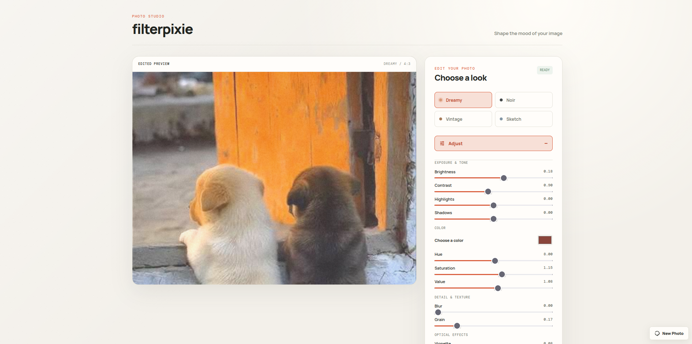

# FilterPixie

FilterPixie is a lightweight web app for transforming photos with computer vision. Upload an image, choose an effect style, adjust its intensity, and download the result as a PNG.

The project combines a React and Vite frontend with a Python FastAPI backend. Image processing happens on demand and images are returned directly to the browser without permanent storage.

## Features

- Dreamy, noir, vintage, sketch, and neon parameter presets
- Manual controls for exposure, color, tone, detail, texture, and optical effects
- In-memory image processing with a modular OpenCV and NumPy pipeline

## Live app

https://rahatut.github.io/filter-pixie/

## Preview



### Filter examples

| Dreamy | Neon | Sketch |
| --- | --- | --- |
|  |  |  |

| Noir | Vintage |
| --- | --- |
|  |  |

## Run locally

Start the backend in one terminal:

```bash
cd backend && source venv/bin/activate && uvicorn main:app --reload
```

Start the frontend in another:

```bash
cd frontend && npm install && npm run dev
```

Open the local Vite URL shown in the terminal. The frontend proxies API requests to `http://localhost:8000`.

## Deployment

### GitHub Pages

The workflow at `.github/workflows/deploy-pages.yml` builds and deploys the frontend automatically whenever `main` changes. GitHub repository settings must use **Settings > Pages > Source: GitHub Actions**.

### Render

The backend runs as a Render **Web Service** with:

```text
Root Directory: backend
Build Command: pip install -r requirements.txt
Start Command: uvicorn main:app --host 0.0.0.0 --port $PORT
```

The backend allows the GitHub Pages origin by default. For a different frontend domain, set this Render environment variable:

```env
CORS_ORIGINS=https://your-frontend.example.com
```

## Filter engine

FilterPixie uses one `FilterEngine` for every image. Presets only provide values for the shared `FilterParameters` object; they do not contain image-processing code. The pipeline applies these stages in order:

1. Exposure
2. Color
3. Tone
4. Detail
5. Texture
6. Optical effects

The API accepts the existing `filter_name` and `intensity` fields, plus an optional `parameters` JSON object for manual overrides. For example:

```json
{"brightness": 0.08, "contrast": 0.9, "hue": 8, "saturation": 1.15, "value": 1.08, "grain": 0.02}
```

Use `GET /parameters` to retrieve preset values and the parameter metadata used to build controls.
Color adjustments use global HSV controls: `hue` is measured in degrees and wraps around the color wheel, while `saturation` and `value` are multipliers where `1` preserves the source.

## Project structure

```text
backend/   FastAPI API, parameter presets, and the shared OpenCV engine
frontend/  React and Vite application
```
